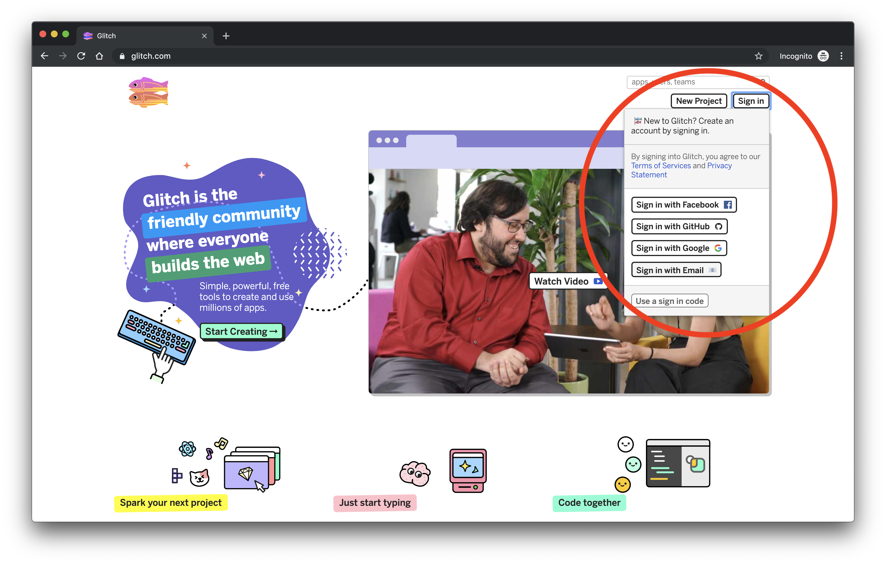
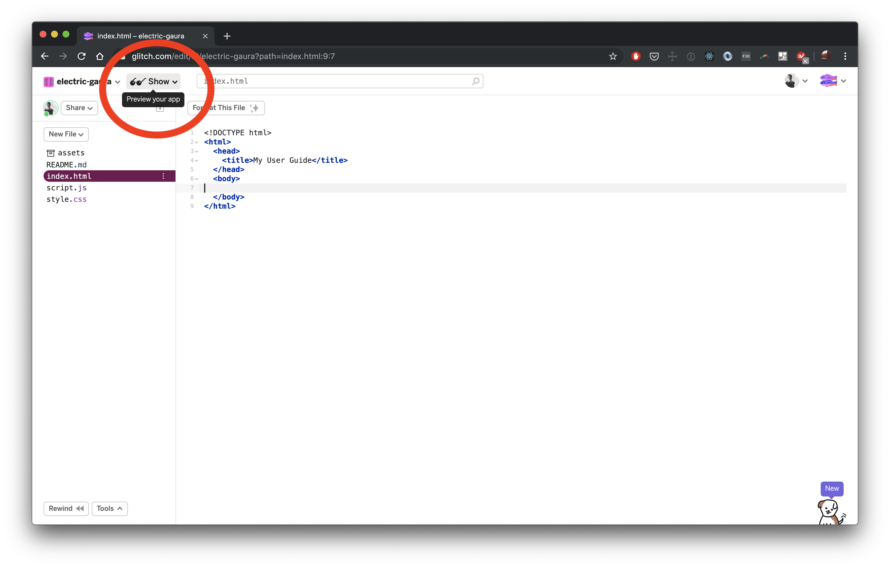
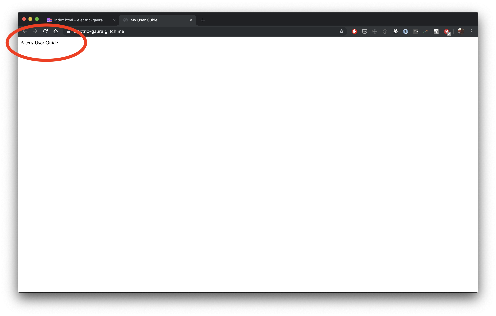

# Class 0 - Hello World!

## Setting Goals

Now is the time to set personal goals for the fellowship. We will set:

- Long term goals
- Weekly goals

Goals should be SMART!

- Specific
- Measurable
- Attainable
- Relevant
- Timely

Working with your pod mates and mentors, set at least 2 SMART long-term goals and at least 3 SMART weekly goals!

**Example long term goals:**

By the end of the program I want to be able to...

- Build an app
- Make a game
- Design and build a website for my business
- Use the Internet to find information about anything
- Apply principles of digital security to use technology safely
- Type without looking at the keyboard
- Teach others how to build a website

**Example weekly goals:**

For next week, I will...

- Use Google to research how change the background color of my website
- Add links and images to my first website
- Complete The Coding Train p5.js tutorials 1 & 2
- Read the MDN introduction to JavaScript
- Practice typing on typingclub for 20 min every day
- Write a "Hello World" python program
- Draw wireframes for my app

Our long-term goals may change over time and we will set new weekly goals every week!


## Installfest!

### Google Chrome

Google Chrome is the browser we will use to learn to code.

- Download Google Chrome here: [https://www.google.com/chrome/
  ](https://www.google.com/chrome/)

### Slack

Slack is a messaging app. We will use it to communicate about class, code, anything and everything!

- Download Slack here: [https://slack.com/downloads](https://slack.com/downloads)
- Join the `#2019-fellowship` channel!
- Start chatting :)

## What is HTML?

- [MDN - What is HTML?](https://developer.mozilla.org/en-US/docs/Learn/HTML/Introduction_to_HTML/Getting_started)
- [http://www.goodellgroup.com/tutorial/chapter1.html](http://www.goodellgroup.com/tutorial/chapter1.html)

## Set up your User Guide

### What is a User Guide?

A User Guide is like a "How To" for a human being.

Here is an example User Guide:

> **Name:** Danielle

> **Pronouns:** She/her/hers

> **Astrological sign:** Aries

> **Favorite food:** Tacos

> **Favorite song:** Q.U.E.E.N. by Janelle Monáe

> **List your top 3 strengths:**

> Deliberative, Individualization, Restorative.

> **What I value**

> Empathy, curiosity, and consideration. A clear prioritization of everyone’s best interests. A successful working partnership takes into account our humanity and that we might be in disparate emotional places at the start of an interaction. I value community and try to make sure people feel a foundational level of safety in whatever space we’re in together.

> **What I need to be successful**

> Transparency, a clear picture of our goal. Alone time to understand the material/task at hand in my own way, coupled with voice-to-voice collaboration to clarify issues or solve stubborn problems together.

> **The best way to motivate me to do something**

> Talking about how the end goal benefits the user’s life. Giving advance notice, clearly communicating the goal and the acceptance criteria.

> **How to best communicate with me**

> I like direct feedback in voice-to-voice conversation ideally. For simple matters, I prefer Slack messages, and for matters where clarifying questions are likely, calls. I prefer that people approach me with the acknowledgement that we are humans first, before our job titles. Everyone is worth the same, and that knowledge should color all interactions.

> **What people misunderstand about me**

> I’ve been told that I can seem aloof or uninterested upon first meeting, because I’m not quick to speak. It takes a lot for me to speak up in unfamiliar settings, with new people, and in large group settings. I can if absolutely necessary, but am most comfortable in small group settings and with a substantial period of shared proximity before speaking at length to or with anyone.

---

### Write your User Guide!

We will use Glitch to create our User Guide. Glitch is a website that makes it super easy to write and share code.

1. Go to [http://glitch.com](http://glitch.com)

2. Sign up using your email address and a password (make sure to choose a password you will remember)



3. Once you are signed in, click on "New Project" and select "hello-webpage"


4. This is your new Glitch project! Take some time to read the `README.md` file.
   - You'll see `README` files often - a `README` is a plain text file that explains how an application works and how to interact with it. It's a source of documentation for an app.


5. Select the `index.html` file and DELETE EVERYTHING in it


6. Copy and paste the following into it (we will go over this code in a moment)

```
<!DOCTYPE html>
<html>
  <head>
    <title>My User Guide</title>
  </head>
  <body>

  </body>
</html>
```

7. Click on the "Show" button



8. You should see... a blank page!


9. Go back to your Glitch project and add the following between the two `<body> </body>` tags

```
<body>

  Alex's User Guide

</body>
```

10. Refresh your project show page. You should see:



11. Write the rest of your User Guide! Use Google to research how to make your user guide page.
    - TODO: Add a suggestion for a few HTML tags to use, maybe `<p>`, `<b>`, maybe inline styling?
    - Try searching for "thing I want to do" + "HTML" and see what results come up!

12) Share your User Guide (the link should look like `some-words.glitch.me`) with everyone in Slack.

Great job!

✨✨✨
