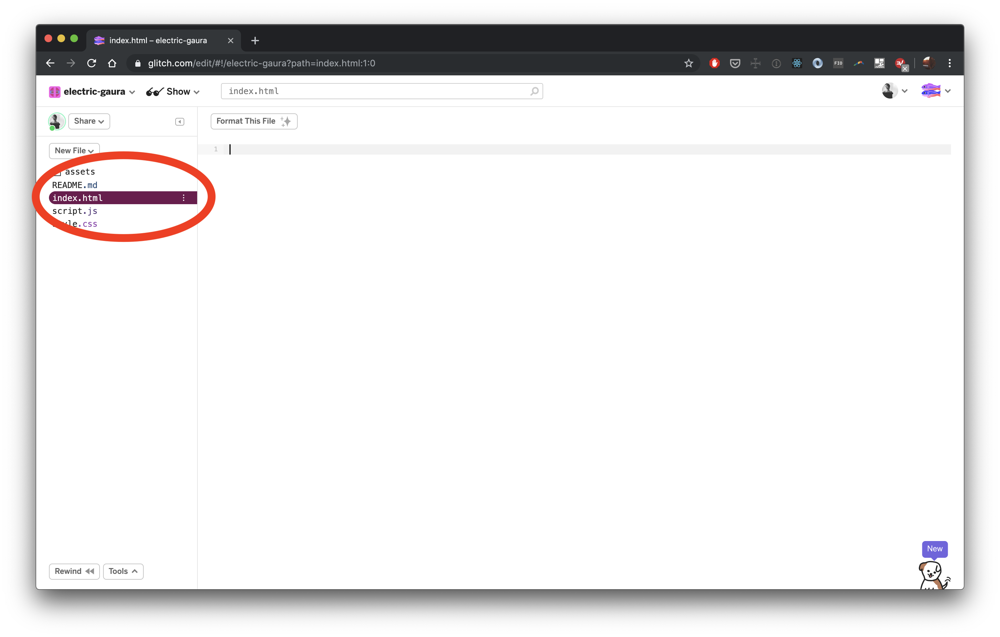

# Class 0 - Hello World!

## Setting Goals

TODO

## Installfest!

### Google Chrome

Google Chrome is the browser we will use to learn to code.

* Download Google Chrome here: https://www.google.com/chrome/

### Slack

Slack is a messaging app. We will use it to communicate about class, code, anything and everything!

* Download Slack here: https://slack.com/downloads
* Join the #2019-fellowship channel!
* Start chatting :)

## Set up your User Guide

### What is a User Guide?

A User Guide is like a "How To" for a human being.

Here is Tolu's User Guide:

**Name:** Tolu

**Pronouns:** She/her/hers

**Astrological sign:**

**Favorite food:**

**Favorite song:**

**List your top 3 strengths:**

Deliberative, Individualization, Restorative.

**What I value**

Empathy, curiosity, and consideration. A clear prioritization of everyone’s best interests. A successful working partnership takes into account our humanity and that we might be in disparate emotional places at the start of an interaction. I value community and try to make sure people feel a foundational level of safety in whatever space we’re in together.

**What I need to be successful**

Transparency, a clear picture of our goal. Alone time to understand the material/task at hand in my own way, coupled with voice-to-voice collaboration to clarify issues or solve stubborn problems together.

**The best way to motivate me to do something**

Talking about how the end goal benefits the user’s life. Giving advance notice, clearly communicating the goal and the acceptance criteria.

**How to best communicate with me**

I like direct feedback in voice-to-voice conversation ideally. For simple matters, I prefer Slack messages, and for matters where clarifying questions are likely, calls. I prefer that people approach me with the acknowledgement that we are humans first, before our job titles. Everyone is worth the same, and that knowledge should color all interactions.

**What people misunderstand about me**

I’ve been told that I can seem aloof or uninterested upon first meeting, because I’m not quick to speak. It takes a lot for me to speak up in unfamiliar settings, with new people, and in large group settings. I can if absolutely necessary, but am most comfortable in small group settings and with a substantial period of shared proximity before speaking at length to or with anyone.

---

### Write your User Guide!

We will use Glitch to create our User Guide. Glitch is a website that makes it super easy to write and share code.

1. Go to http://glitch.com

2. Sign up using your email address and a password (make sure to choose a password you will remember)


3. Once you are signed in, click on "New Project" and select "hello-webpage"


4. This is your new Glitch project! Take some time to read the README.md file


5. Select the "index.html" file and DELETE EVERYTHING in it

6. Copy and paste the following into it (we will go over this code in a moment)

```
<!DOCTYPE html>
<html>
  <head>
    <title>My User Guide</title>
  </head>
  <body>

  </body>
</html>
```

7. Click on the "Show" button



8. You should see... a blank page!


9. Go back to your Glitch project and add the following between the two `<body> </body>` lines

```
<!DOCTYPE html>
<html>
  <head>
    <title>My User Guide</title>
  </head>
  <body>

    Alex's User Guide

  </body>
</html>
```

10. Refresh your project show page. You should see:


11. Write the rest of your User Guide! Use Google to research how to make your user guide page

12. Share your User Guide link (should look like `some-words.glitch.me`) with everyone in Slack.

